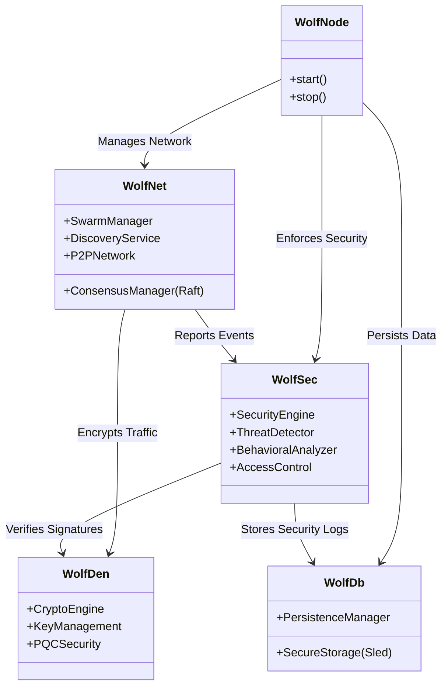

# Wolf Prowler - Monitoring Environment Guide

This document provides instructions for setting up the isolated Docker testing environment for Wolf Prowler, along with system architecture and network diagrams.

## 🚀 Setup Instructions

### 1. Build and Start the Environment
This command will build the `wolf_prowler` image from your current source code and start 3 headless nodes plus a Kali Linux monitoring node.

```bash
docker-compose -f MonitoringEnvirnonment.yml up -d --build
```

### 2. Access the Kali Monitoring Node
Attach to the Kali Linux container to access network monitoring tools.

```bash
docker exec -it kali_monitor /bin/bash
```

### 3. Monitor Network Traffic
Inside the Kali container, use `tcpdump` to capture traffic on the shared bridge network.

```bash
# Capture all traffic on the main interface
tcpdump -i eth0

# Capture only traffic between Wolf Nodes (exclude internal broadcast/noise if needed)
tcpdump -i eth0 port 3001 or port 3002 or port 3003
```

---

## 🏗️ System Architecture: Wolf Prowler Node

The following diagram illustrates the internal architecture of a single Wolf Prowler node (`wolf_prowler`).



---

## 🌐 Network Topology: Docker Monitoring Lab

The following diagram shows the network layout defined in `MonitoringEnvirnonment.yml`. All nodes are connected to a private bridge network `wolf_net`, allowing the Kali node to perform Man-in-the-Middle (MitM) analysis or passive sniffing.

```mermaid
graph TD
    subgraph "Docker Host"
        subgraph "Network: wolf_net (Bridge)"
            Direction TB
            
            WN1[Wolf Node 1<br/>(Bootstrap)<br/>Port: 3001]
            WN2[Wolf Node 2<br/>(Peer)<br/>Port: 3002]
            WN3[Wolf Node 3<br/>(Peer)<br/>Port: 3003]
            
            KALI[Kali Monitor<br/>(Sniffer/Attacker)<br/>Privileged Mode]
            
            WN1 <--> WN2
            WN1 <--> WN3
            WN2 <--> WN3
            
            %% Kali can see all traffic on the bridge if configured promiscuously 
            %% or via arp spoofing in a real bridge scenario, 
            %% but conceptually it sits on the same segment.
            KALI -.-> WN1
            KALI -.-> WN2
            KALI -.-> WN3
        end
    end

    style KALI fill:#f96,stroke:#333,stroke-width:2px
    style WN1 fill:#bbf,stroke:#333,stroke-width:2px
    style WN2 fill:#ddf,stroke:#333,stroke-width:1px
    style WN3 fill:#ddf,stroke:#333,stroke-width:1px
```

## 📋 Node Roles

| Node | Role | Port | Description |
|------|------|------|-------------|
| **wolf_node_1** | **Bootstrap / Seed** | 3001 | Initialization point for the cluster. Other nodes connect here first. |
| **wolf_node_2** | **Peer** | 3002 | Standard node, connects to Node 1. |
| **wolf_node_3** | **Peer** | 3003 | Standard node, connects to Node 1. |
| **kali_monitor** | **Observer** | N/A | Privileged container with network tools (`tcpdump`, `nmap`) for analysis. |
