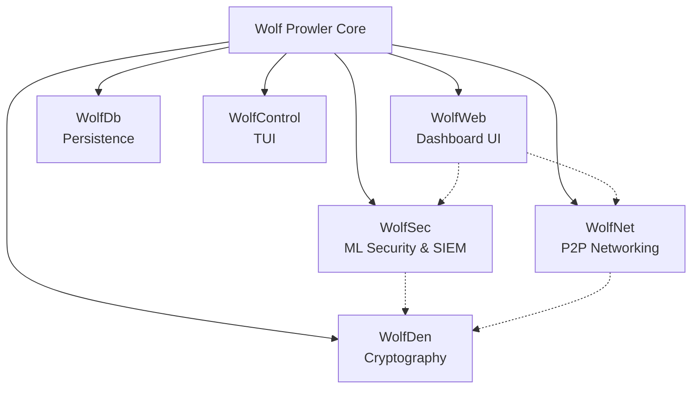

<p align="center">
  
</p>

# Wolf Prowler
**Enterprise-Grade Neural Security & Networking Platform**

> **Status**: Production Ready (WolfNet, WolfSec, WolfWeb) | **Version**: 2.0.0

## Project Ethos
This system is designed under the pretense of **Cybersecurity**. While the code is open source, the design philosophy, "Wolf Theme", and intellectual property concerning the presentation belong to the creator, **Terrence A. Jones**.

Please read [GUIDELINES.md](GUIDELINES.md) for the full Intellectual Property statement and project direction.

---

**Wolf Prowler** is a centralized security and networking platform for modern distributed systems. It unifies military-grade cryptography, machine learning-powered threat detection, automated incident response (SOAR), and peer-to-peer networking into a cohesive, enterprise-grade ecosystem.

## System Architecture



## Core Components

### WolfDen - Cryptographic Engine
The foundation of the platform's security, implementing NIST FIPS 140-3 compliant operations. It supports multiple security levels (Low, Medium, High) and provides post-quantum cryptographic primitives.

### WolfNet - P2P Networking
A secure, decentralized mesh networking layer built on `libp2p`. It features encrypted communications (X25519 + ChaCha20-Poly1305), QUIC transport for low latency, and robust peer discovery mechanisms.

### WolfSec - ML Security & SOAR
The intelligence center of the platform. It utilizes ONNX and Linfa for machine learning-based threat detection, coupled with a SOAR engine for automated incident response and MITRE ATT&CK correlation.

### WolfWeb - Dashboard
A modern, responsive web interface built with Dioxus. It provides real-time visualization of network topology, security events, system health, and administrative controls.

### WolfDb - Persistence
A specialized storage engine handling diverse data types, from relational records to vector embeddings for ML models, ensuring data integrity and rapid access.

### WolfControl - TUI
A terminal-based user interface for headless management, offering low-level control over the system's operation and monitoring.

## Getting Started

### Prerequisites
- Rust 1.75+
- PostgreSQL 14+ (optional, for legacy support)
- Build tools (`build-essential`, `pkg-config`, `libssl-dev`)

### Installation

```bash
# Clone the repository
git clone https://github.com/tariqselassie-hub/WolfProwlerCyberSuite.git
cd WolfProwlerCyberSuite

# Build release binary
cargo build --release

# Run with full ML capabilities
cargo build --release --features ml-full
```

## Contributing
We welcome contributions! Please see [CONTRIBUTING.md](CONTRIBUTING.md) for guidelines.

## License
Licensed under either of Apache License, Version 2.0 or MIT license at your option. see [LICENSE-APACHE](LICENSE-APACHE) and [LICENSE-MIT](LICENSE-MIT).

## Acknowledgments
This project stands on the shoulders of giants. Special thanks to the creators and maintainers of:

*   **Tokio**: For the asynchronous runtime that powers our concurrency.
*   **Axum**: For the robust and ergonomic web server framework.
*   **Dioxus**: For enabling a Rust-based full-stack web experience.
*   **Ratatui**: For the sophisticated terminal user interface capabilities.
*   **Libp2p**: For the foundational peer-to-peer networking components.
*   **SQLx**: For safe and efficient database interactions.
*   **PQC Dilithium / Kyber**: For post-quantum cryptographic assurance.
*   **Linfa**: For bringing classical machine learning to the Rust ecosystem.
*   **ONNX Runtime (ort)**: For high-performance deep learning inference.

---
<p align="center">
  <strong>Built with Rust for Security, Performance, and Reliability</strong>
</p>
