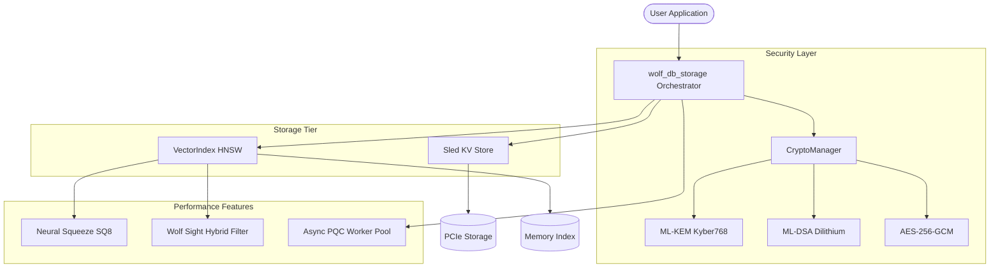

# wolf_db: Post-Quantum Hybrid Database

wolf_db is a high-performance, secure-by-default database system that bridges the gap between Relational bincode-serialized storage and HNSW Vector Similarity Search. It is architected for a zero-trust environment, utilizing Post-Quantum Cryptography (PQC) to secure data at rest and in transition.

## System Architecture

wolf_db utilizes a multi-layered architecture designed to maximize security without sacrificing sub-millisecond query performance.



### Core Components

- **wolf_db_storage**: The primary interface that orchestrates PQC operations, logical storage, and vector indexing.
- **CryptoManager**: Manages the lifecycle of ML-KEM session keys and ML-DSA integrity signatures.
- **VectorIndex**: A thread-safe HNSW implementation supporting logical deletions and real-time scalar quantization.
- **StorageEngine**: A persistent, ACID-compliant key-value store powered by `sled`.

## Technical Breakthroughs

### Neural Revolution Features

1. **Hybrid Filtered Search (Wolf Sight)**
   - Unlike standard vector databases that filter results *after* retrieval, wolf_db integrates `sled`-backed metadata indexing directly into the HNSW graph traversal.
   - This ensures that only records matching specific metadata criteria are considered during similarity search, eliminating the "over-fetching" performance penalty.

2. **Neural Squeeze (SQ8 Quantization)**
   - Reduces the memory and disk footprint of vector indices by 75% through 8-bit scalar quantization.
   - Converts `f32` vectors into unit-normalized `u8` bytes while maintaining high recall accuracy.

3. **Asynchronous PQC Pipeline**
   - Decouples computationally expensive cryptographic operations (ML-KEM and ML-DSA) from the main I/O thread.
   - Utilizes a background worker pool to process ingestion concurrently, maximizing CPU core utilization.

## Security Posture

wolf_db is designed for high-concurrency, zero-trust deployments:

- **Post-Quantum Ready**: Implements ML-KEM-768 for session key encapsulation and ML-DSA-65 (Dilithium2 equivalent) for record signing.
- **Zero-Trust Memory**: Critical secrets and intermediate keys are protected via the `secrecy` and `zeroize` crates to ensure sensitive data is wiped from RAM immediately after use.
- **Hardware Integration**: Supports USB HSM modules via the PKCS#11 standard to protect the database master keys.
- **Encrypted Persistence**: Every record is serialized via `bincode`, encrypted with AES-256-GCM, and signed for tamper-evidence before hitting the `sled` storage layer.

## Performance Metrics

Metrics captured on a 50,000 record dataset using standard PCIe storage and 8-core CPU architecture.

| Operation | Latency | Capability |
| :--- | :--- | :--- |
| ML-KEM Encapsulation | 39.0 microseconds | Future-proof session key exchange |
| ML-DSA Signing | 177.3 microseconds | Per-record integrity verification |
| Vector Search (k=5) | 223.1 microseconds | High-density HNSW similarity |
| Hybrid Metadata Search | 8.0 milliseconds | Constrained search across 50k nodes |
| Parallel Ingestion | 1.6 milliseconds/rec | Massive scale with full PQC overhead |

## Configuration and Usage

### Initialization

Upon first launch, the system requires the creation of a Post-Quantum Keystore.

```bash
# Initialize with a master password and optional HSM PIN
wolf_db init --hsm
```

### Basic Operations

wolf_db provides a comprehensive REPL for data management.

```text
# Insert an encrypted, signed vector record
insert user_001 {"role": "admin"} --vector [1.0, 0.5, -0.2]

# Perform a hybrid filtered similarity search
search [1.0, 0.4, -0.1] --k 5 --filter role=admin
```

## Installation

### Dependencies
- Rust Toolchain 1.75 or later.
- libpcsclite-dev (required for hardware key support).
- GNUPlot (optional for benchmark visualization).

### Building from Source
```bash
cargo build --release
```

## Integration with Wolf Prowler

WolfDb serves as the unified storage backend for the Wolf Prowler ecosystem:

- **wolfsec**: Stores security events, peer baselines, ML model data, and SIEM correlation results
- **lock_prowler**: Persists forensic session data and incident response artifacts
- **wolf_web**: Provides database exploration and query interface through the dashboard
- **wolf_den**: Utilizes WolfDb for secure key material storage

### Migration from PostgreSQL

Wolf Prowler has migrated from PostgreSQL to WolfDb to achieve:
- Post-quantum cryptographic security for all stored data
- Embedded deployment with no external database dependencies
- ML-L2 vector search for behavioral analysis and anomaly detection
- Sub-millisecond query performance with PQC overhead

## License

Licensed under either of Apache License, Version 2.0 or MIT license at your option.

See [LICENSE-APACHE](../../LICENSE-APACHE) and [LICENSE-MIT](../../LICENSE-MIT) for details.
