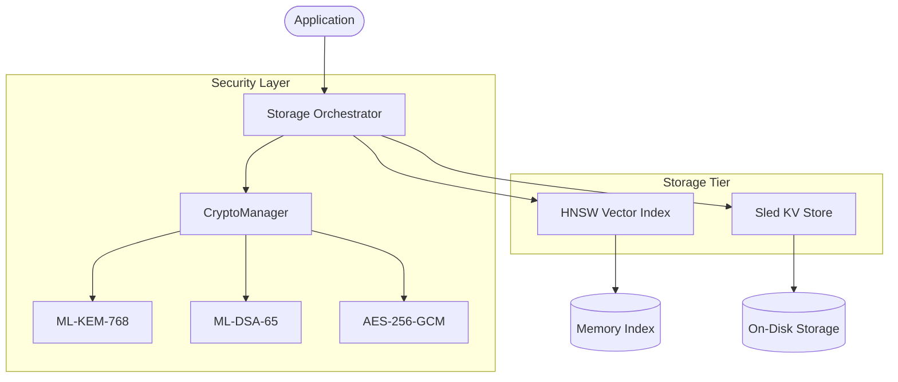

# WolfDb: Post-Quantum Vector Database

> **Status**: Production Ready (Version 0.1.0)
> **Backend**: Sled (KV) + HNSW (Vector)
> **Security**: ML-KEM-768 (Kyber) + ML-DSA-65 (Dilithium)

WolfDb is a high-performance, embedded database specialized for the Wolf Prowler ecosystem. It combines an ACID-compliant Key-Value store (`sled`) with an HNSW-based Vector Index (`hnsw_rs`) to support hybrid metadata and similarity searches secured by Post-Quantum Cryptography.

## 🏗️ Architecture

WolfDb operates as an embedded engine with an optional network layer (Axum). Data is serialized (`bincode`), encrypted, and indexed in parallel.



### Core Components

1.  **Storage Engine**: Wraps `sled` to provide transactional byte-storage. All values are transparently encrypted using AES-256-GCM with keys negotiated via PQC.
2.  **Vector Index**: Uses Hierarchical Navigable Small World (HNSW) graphs for `f32` vector similarity search. Supports 8-bit Scalar Quantization (SQ8) to reduce memory usage by ~75%.
3.  **Crypto Manager**: Handles key lifecycle. Uses `fips203` (Kyber) for KEM and `fips204` (Dilithium) for digital signatures of records.

## 🛡️ Security Posture

WolfDb enforces a "Zero Trust" data model:

*   **Data at Rest**: AES-256-GCM encryption.
*   **Integrity**: Every record is signed with ML-DSA-65 (Dilithium) to prevent tampering.
*   **Key Protection**: PQC keys are protected in memory using `secrecy` and `zeroize` traits.
*   **HSM Support**: Integration with PKCS#11 for hardware-backed master keys.

## 💻 Usage

### CLI Operations

WolfDb provides a REPL for direct management.

```bash
# Initialize storage
wolf_db init --hsm

# Insert vector record
wolf_db> insert user_01 {"role": "admin"} --vector [1.0, 0.5, -0.2]

# Hybrid Search (Vector + Metadata Filter)
wolf_db> search [1.0, 0.4, -0.1] --k 5 --filter role=admin
```

### Library Usage

```rust
use wolf_db::{WolfDb, WolfDbConfig};

#[tokio::main]
async fn main() -> anyhow::Result<()> {
    // 1. Initialize
    let db = WolfDb::new(WolfDbConfig::default()).await?;
    
    // 2. Insert Data
    let vector = vec![0.1, 0.2, 0.3];
    db.insert("doc_1", b"content", Some(vector)).await?;
    
    // 3. Search
    let results = db.search(vec![0.1, 0.2, 0.3], 5).await?;
    
    Ok(())
}
```

## 📊 Performance Metrics

Benchmarks on 8-core CPU / PCIe Gen4 SSD:

| Operation | Latency (avg) | Note |
| :--- | :--- | :--- |
| **PQC Encapsulation** | ~39 µs | ML-KEM-768 |
| **PQC Signing** | ~177 µs | ML-DSA-65 |
| **Vector Search (k=5)** | ~220 µs | HNSW + SQ8 |
| **Ingestion** | ~1.6 ms/rec | Full Encryption + Signing |

## 📦 Dependencies

*   `sled`: Storage engine.
*   `pqc_kyber` / `fips204`: Post-Quantum primitives.
*   `hnsw_rs`: Vector indexing.
*   `axum`: (Optional) HTTP API.
