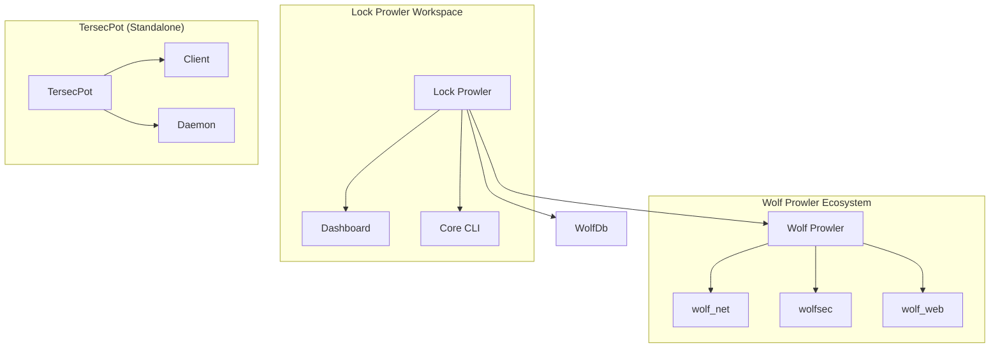

# Project Map 1-5-26

## 🌐 Ecosystem Overview

This document maps the currently active Rust workspaces and projects within the user's environment as of January 5th, 2026.

### 📁 Project Locations

| Project Name | Location | Type | Notes |
| :--- | :--- | :--- | :--- |
| **Lock Prowler** | `/home/t4riq/Project1/lock_prowler` | Workspace | Forensics & Recovery |
| **WolfDb** | `/home/t4riq/Project1/WolfDb` | Crate | PQC-Secured Database |
| **Wolf Prowler** | `/home/t4riq/Desktop/Rust/wolf_prowler` | Workspace | P2P Security Network |
| **TersecPot** | `/home/t4riq/Project1/TersecPot/tercespot` | Workspace | Secure Enclave & Privacy |

---

## 🏗️ Detailed Hierarchy

### 1. Lock Prowler
**Role:** BitLocker Recovery & Forensic Analysis
**Workspace Root:** `/home/t4riq/Project1/lock_prowler`
**Members:**
- `lock_prowler` (Core Logic)
- `lock_prowler_dashboard` (Dioxus Web UI)
- *Linked External Members:*
    - `../WolfDb`
    - `../../Desktop/Rust/wolf_prowler`

### 2. Wolf Prowler
**Role:** Advanced P2P Security Network & Threat Intelligence
**Workspace Root:** `/home/t4riq/Desktop/Rust/wolf_prowler`
**Members:**
- `wolf_net` (Networking Layer)
- `wolf_web` (Dashboard & API)
- `wolf_den` (Crypto Core)
- `wolfsec` (Security Logic)
- `wolf_server` (Server Node)
- `wolf_control` (Control Plane)

### 3. WolfDb
**Role:** High-Performance PQC Vector Database
**Workspace Root:** `/home/t4riq/Project1/WolfDb`
**Type:** Single Crate
**Key Features:** `sled`, `pqc_kyber`, `pqc_dilithium`, `hnsw_rs`

### 4. TersecPot
**Role:** High-Assurance Secure Enclave
**Workspace Root:** `/home/t4riq/Project1/TersecPot`
**Members:**
- `client` (User Interface)
- `daemon` (Background Service)
- `shared` (Common Logic)
- `ceremony` (Key Generation)
- `airgap` (Offline Protocols)
- `privacy` (Data Protection)

---

## 🔄 Inter-Project Relationships

> [!NOTE]
> `Lock Prowler` is currently configured as a "Super Workspace" that pulls in `WolfDb` and `Wolf Prowler` to allow for cross-project development and integration. `TersecPot` remains a standalone secured workspace.
