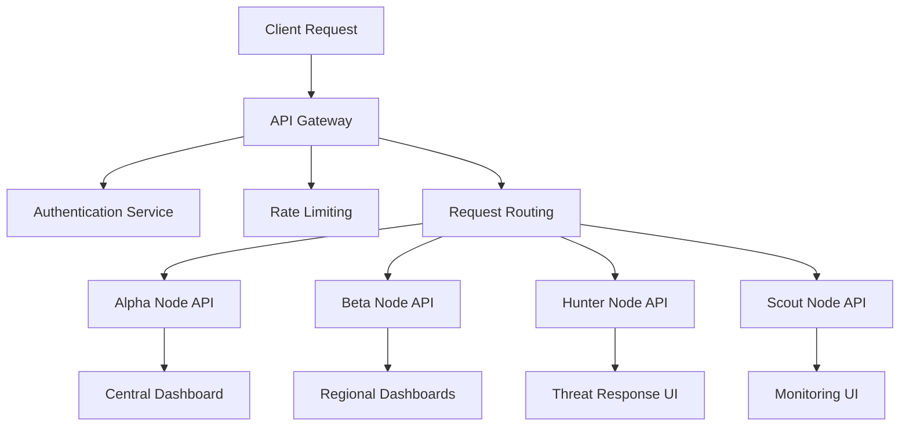
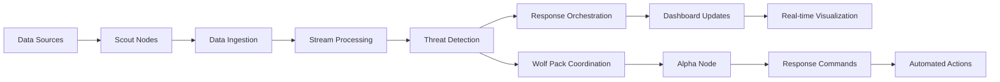
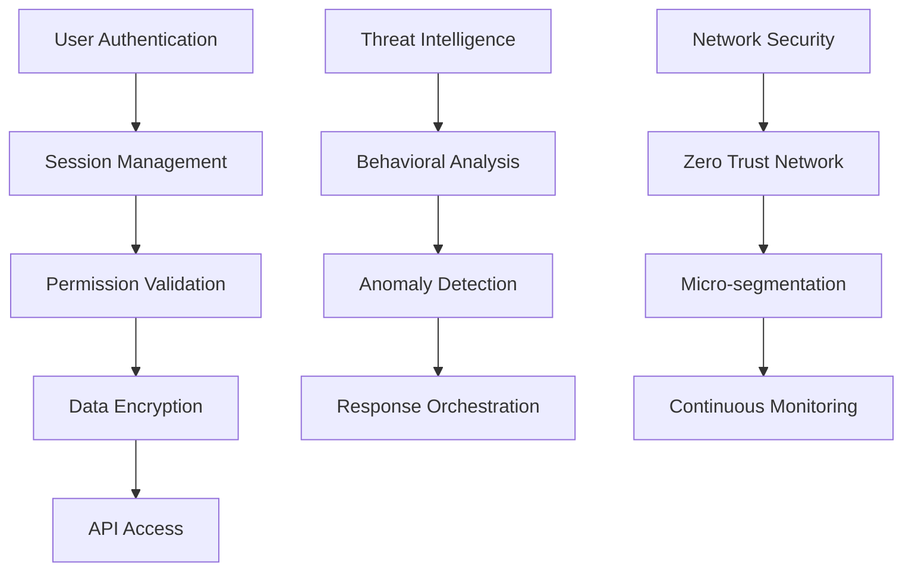

# Enterprise SIEM/SOAR Dashboard Architecture

## Overview

This document outlines the revolutionary architecture for the Wolf Prowler Enterprise SIEM/SOAR dashboard, designed to leverage the full power of the Wolf Pack distributed security network.

## Architecture Principles

### 1. Wolf Pack Distributed Intelligence
- **Alpha Nodes**: Central command and coordination
- **Beta Nodes**: Regional analysis and correlation
- **Hunter Nodes**: Threat detection and response
- **Scout Nodes**: Data collection and monitoring
- **Stray Nodes**: External integrations and sensors

### 2. Zero-Trust Security Model
- End-to-end encryption for all communications
- Multi-factor authentication with behavioral biometrics
- Continuous risk assessment and adaptive security
- Micro-segmentation of dashboard components

### 3. Real-Time Processing Architecture
- Event-driven architecture with Kafka-style streaming
- In-memory data grids for sub-second response times
- Edge computing for distributed threat analysis
- AI/ML-powered anomaly detection at scale

## Core Components

### 1. Dashboard API Gateway

### 2. Data Flow Architecture

### 3. Security Integration Layers

## Revolutionary Features

### 1. Wolf Pack Command Center
- **Pack Hierarchy Visualization**: Real-time view of Alpha, Beta, Hunter, Scout, and Stray nodes
- **Collective Intelligence Dashboard**: Aggregated threat intelligence from all pack members
- **Coordinated Response System**: Automated response orchestration across the pack
- **Prestige System Integration**: Gamified security operations with role-based access

### 2. AI-Powered Threat Hunting
- **Predictive Analytics**: ML models predicting attack patterns before they occur
- **Behavioral Baselines**: Dynamic baselines for each node and user
- **Threat Attribution**: Advanced correlation for attack source identification
- **Automated Playbooks**: Self-evolving response procedures

### 3. Real-Time Security Operations
- **Live Threat Map**: Global visualization of security events
- **Incident Timeline**: Chronological view of security incidents
- **Response Effectiveness**: Real-time metrics on response actions
- **Resource Allocation**: Dynamic assignment of security resources

### 4. Compliance and Governance
- **Automated Compliance Monitoring**: Real-time compliance status across all regulations
- **Audit Trail Management**: Immutable logs with blockchain-style verification
- **Policy Enforcement**: Automated policy compliance checking
- **Risk Assessment**: Continuous risk scoring and mitigation recommendations

## Implementation Phases

### Phase 1: Foundation (Current)
- Basic API endpoints for all components
- WebSocket real-time updates
- Authentication and authorization framework
- Core dashboard state management

### Phase 2: Integration (Next)
- Real-time data integration with Wolf Pack components
- Enhanced WebSocket functionality
- Advanced authentication with MFA
- Comprehensive error handling

### Phase 3: Intelligence (Future)
- AI/ML integration for threat detection
- Predictive analytics dashboard
- Automated response orchestration
- Advanced visualization components

### Phase 4: Enterprise (Advanced)
- Multi-tenant support
- Advanced compliance features
- Performance optimization
- High availability and disaster recovery

## Technology Stack

### Backend
- **Rust**: Core dashboard logic and API
- **Axum**: Web framework for API endpoints
- **Tokio**: Async runtime for high performance
- **Serde**: Serialization for data exchange
- **Chrono**: Time handling for security events

### Frontend (Planned)
- **React/TypeScript**: Modern web interface
- **D3.js**: Advanced data visualization
- **WebSocket**: Real-time updates
- **Tailwind CSS**: Responsive design

### Database
- **PostgreSQL**: Primary data storage
- **Redis**: Caching and real-time data
- **TimescaleDB**: Time-series data for metrics

### Security
- **WolfSec**: Advanced security framework
- **TLS 1.3**: Encrypted communications
- **JWT/OAuth2**: Authentication protocols
- **Zero Trust**: Security architecture

## Performance Targets

### Response Times
- API Response: < 100ms
- Dashboard Updates: < 1s
- Threat Detection: < 5s
- Response Orchestration: < 10s

### Scalability
- Concurrent Users: 10,000+
- Events per Second: 100,000+
- Data Retention: 7 years
- Geographic Distribution: Global

### Availability
- Uptime: 99.99%
- Recovery Time: < 5 minutes
- Data Loss: < 1 second

## Security Considerations

### Data Protection
- End-to-end encryption for all data
- Secure key management with HSM integration
- Data anonymization for privacy compliance
- Secure backup and recovery procedures

### Access Control
- Role-based access control (RBAC)
- Attribute-based access control (ABAC)
- Just-in-time (JIT) access provisioning
- Continuous access validation

### Monitoring and Auditing
- Comprehensive logging of all operations
- Real-time security monitoring
- Automated compliance checking
- Incident response tracking

## Integration Points

### External Systems
- SIEM Integration: Splunk, QRadar, ArcSight
- SOAR Integration: Demisto, Phantom, Resilient
- Threat Intelligence: VirusTotal, MISP, STIX/TAXII
- Cloud Platforms: AWS, Azure, GCP security services

### Internal Systems
- Wolf Pack Network: All node types
- Threat Detection Engine: Real-time analysis
- Behavioral Analysis: User and entity behavior
- Anomaly Detection: Pattern recognition
- Reputation System: Trust scoring

This architecture represents a revolutionary approach to enterprise security operations, leveraging the distributed power of the Wolf Pack to provide unparalleled security visibility and response capabilities.