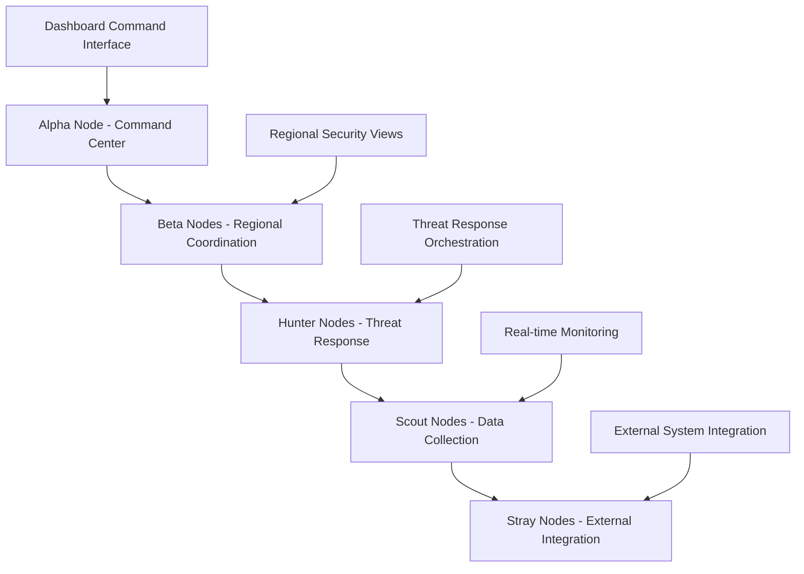

# Revolutionary Dashboard Features

## Overview

This document outlines the revolutionary features that will make the Wolf Prowler Enterprise SIEM/SOAR dashboard a game-changer in the security operations landscape, leveraging the unique capabilities of the Wolf Pack distributed architecture.

## 1. Pack Intelligence Command Center

### 1.1 Collective Threat Intelligence
- **Real-time Pack-wide Threat Map**: Global visualization of threats detected by all pack members
- **Threat Correlation Engine**: Cross-pack analysis to identify sophisticated attack patterns
- **Predictive Threat Analytics**: ML-powered prediction of attack vectors based on pack behavior
- **Threat Attribution System**: Advanced correlation to identify attack sources across distributed nodes

### 1.2 Pack Hierarchy Visualization

### 1.3 Prestige-Based Access Control
- **Dynamic Role Assignment**: Automatic role elevation based on pack performance
- **Gamified Security Operations**: Points system for effective threat detection and response
- **Leaderboard Integration**: Competitive elements to drive security excellence
- **Achievement System**: Recognition for exceptional security operations

## 2. AI-Powered Security Operations

### 2.1 Predictive Security Analytics
- **Behavioral Baseline Learning**: AI learns normal patterns for each pack member and user
- **Anomaly Detection at Scale**: Real-time anomaly detection across millions of events
- **Attack Path Prediction**: ML models predict likely attack paths before they occur
- **Automated Threat Hunting**: AI-driven proactive threat hunting across the pack

### 2.2 Intelligent Response Orchestration
- **Auto-Response Playbooks**: Self-evolving response procedures based on effectiveness
- **Resource Optimization**: AI-driven allocation of security resources across the pack
- **Escalation Intelligence**: Smart escalation based on threat severity and pack capacity
- **Response Effectiveness Analysis**: Continuous improvement of response procedures

### 2.3 Natural Language Security Interface
- **Voice-Activated Security Commands**: Natural language interface for security operations
- **AI Security Assistant**: Conversational interface for security analysis and response
- **Automated Report Generation**: AI-generated security reports in natural language
- **Intelligent Alert Summarization**: AI-powered alert correlation and summarization

## 3. Real-Time Security Operations

### 3.1 Live Threat Timeline
- **Chronological Threat Visualization**: Timeline view of security incidents as they unfold
- **Attack Progression Tracking**: Real-time tracking of ongoing attacks across the pack
- **Response Timeline**: Visualization of response actions and their effectiveness
- **Historical Pattern Analysis**: Analysis of past incidents to improve future responses

### 3.2 Dynamic Security Dashboard
- **Adaptive Dashboard Layout**: Dashboard adapts based on current threat levels and user roles
- **Real-time Metric Updates**: Sub-second updates of all security metrics
- **Interactive Threat Maps**: Clickable threat maps with drill-down capabilities
- **Live Incident Rooms**: Virtual collaboration spaces for active incident response

### 3.3 Automated Compliance Monitoring
- **Real-time Compliance Status**: Continuous monitoring of compliance across all regulations
- **Automated Audit Trail**: Immutable logs with blockchain-style verification
- **Compliance Risk Assessment**: AI-driven assessment of compliance risks
- **Automated Reporting**: Scheduled and on-demand compliance reports

## 4. Advanced Visualization Features

### 4.1 3D Security Topology
- **Network Topology Visualization**: 3D visualization of network architecture and security posture
- **Threat Movement Tracking**: 3D visualization of threat movement through the network
- **Resource Distribution**: 3D view of security resource allocation across the pack
- **Attack Surface Analysis**: 3D visualization of potential attack vectors

### 4.2 Heat Map Analytics
- **Threat Density Heat Maps**: Geographic and logical heat maps of threat activity
- **Vulnerability Heat Maps**: Visualization of vulnerability distribution across systems
- **Performance Heat Maps**: Heat maps of security system performance
- **Resource Utilization Heat Maps**: Visualization of security resource utilization

### 4.3 Interactive Data Exploration
- **Drill-down Capabilities**: Deep dive into any security metric or event
- **Cross-correlation Analysis**: Interactive tools for correlating security events
- **Custom Dashboard Widgets**: User-defined widgets for specific security needs
- **Real-time Data Filtering**: Dynamic filtering of security data in real-time

## 5. Enterprise-Grade Security Features

### 5.1 Zero-Trust Dashboard Architecture
- **Micro-segmentation**: Dashboard components are micro-segmented for security
- **Continuous Authentication**: Continuous verification of user identity and device security
- **Adaptive Access Control**: Access permissions adapt based on risk assessment
- **Secure Communication**: All dashboard communications are encrypted and authenticated

### 5.2 Advanced Threat Intelligence
- **Threat Feed Integration**: Integration with multiple threat intelligence feeds
- **Custom Threat Indicators**: User-defined threat indicators and patterns
- **Threat Intelligence Sharing**: Secure sharing of threat intelligence across the pack
- **Automated Threat Enrichment**: Automatic enrichment of threat data with context

### 5.3 Incident Response Automation
- **Automated Playbook Execution**: Automated execution of incident response playbooks
- **Smart Escalation**: Intelligent escalation based on incident severity and complexity
- **Cross-system Coordination**: Coordination of response actions across multiple systems
- **Post-incident Analysis**: Automated analysis and reporting after incident resolution

## 6. Integration and Extensibility

### 6.1 API-First Architecture
- **RESTful APIs**: Comprehensive REST APIs for all dashboard functionality
- **Webhook Integration**: Real-time webhook notifications for security events
- **Plugin Architecture**: Extensible plugin system for custom functionality
- **Third-party Integration**: Easy integration with existing security tools

### 6.2 Multi-tenant Support
- **Tenant Isolation**: Complete isolation of tenant data and configurations
- **Custom Branding**: Tenant-specific branding and customization
- **Role-based Multi-tenancy**: Different roles and permissions per tenant
- **Resource Quotas**: Configurable resource limits per tenant

### 6.3 Scalability and Performance
- **Horizontal Scaling**: Automatic scaling of dashboard components based on load
- **Caching Strategies**: Advanced caching for optimal performance
- **Load Balancing**: Intelligent load balancing across dashboard instances
- **Performance Monitoring**: Real-time monitoring of dashboard performance

## 7. Future-Ready Features

### 7.1 Quantum-Resistant Security
- **Post-Quantum Cryptography**: Implementation of quantum-resistant encryption algorithms
- **Quantum Key Distribution**: Integration with quantum key distribution systems
- **Future-Proof Architecture**: Design that can adapt to future security requirements

### 7.2 Blockchain Integration
- **Immutable Audit Logs**: Blockchain-based immutable audit trails
- **Smart Contract Integration**: Smart contracts for automated security processes
- **Decentralized Identity**: Integration with decentralized identity systems

### 7.3 Edge Computing Integration
- **Edge Security Analytics**: Security analytics processing at the edge
- **Federated Learning**: ML models trained across edge devices without data sharing
- **Edge Response Coordination**: Coordinated response actions across edge devices

## Implementation Roadmap

### Phase 1: Foundation (Q1 2024)
- Pack Intelligence Command Center
- Basic AI-powered security operations
- Real-time security operations
- Core visualization features

### Phase 2: Intelligence (Q2 2024)
- Advanced AI analytics
- Natural language interface
- Advanced visualization features
- Enterprise-grade security features

### Phase 3: Automation (Q3 2024)
- Full incident response automation
- Advanced threat intelligence
- Multi-tenant support
- Performance optimization

### Phase 4: Future-Ready (Q4 2024)
- Quantum-resistant security
- Blockchain integration
- Edge computing integration
- Advanced AI capabilities

## Competitive Advantages

### 1. Distributed Intelligence
- Leverages the collective intelligence of the Wolf Pack
- Real-time threat detection across distributed nodes
- Coordinated response across multiple security systems

### 2. AI-Powered Operations
- Predictive threat analytics
- Automated response orchestration
- Continuous learning and improvement

### 3. Revolutionary User Experience
- Natural language interface
- Advanced 3D visualizations
- Gamified security operations

### 4. Enterprise-Grade Security
- Zero-trust architecture
- Quantum-resistant encryption
- Blockchain-based audit trails

This revolutionary dashboard will set a new standard for enterprise security operations, combining the power of distributed intelligence with cutting-edge AI and user experience design.