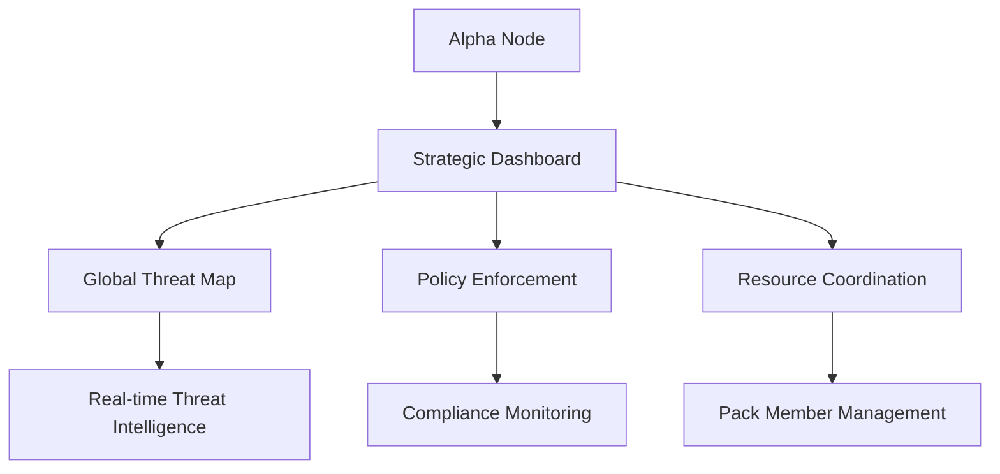
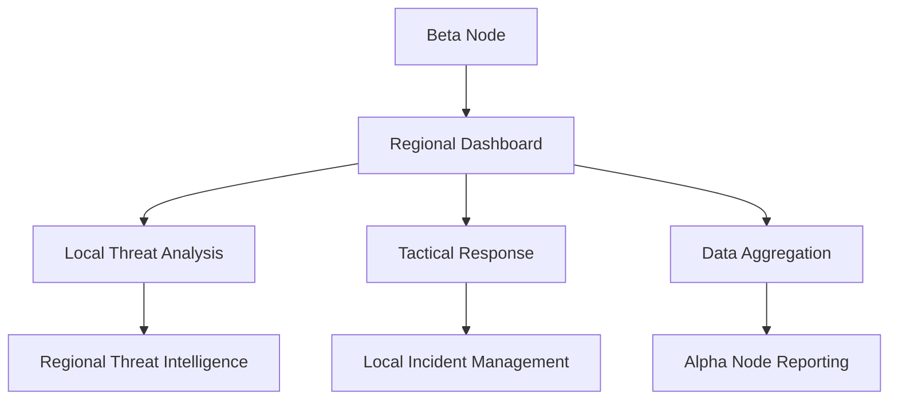
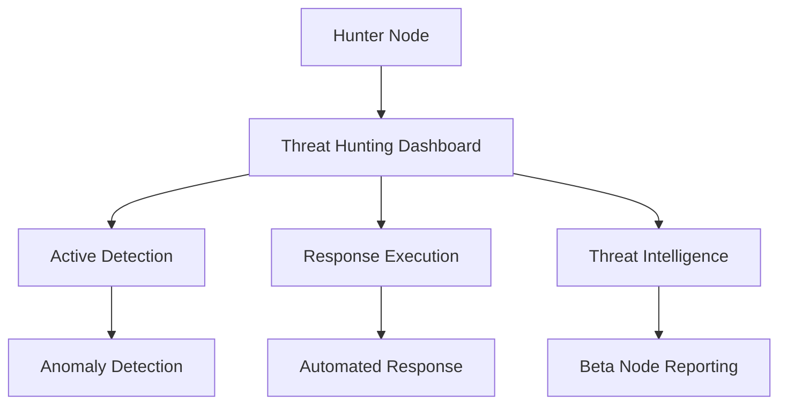
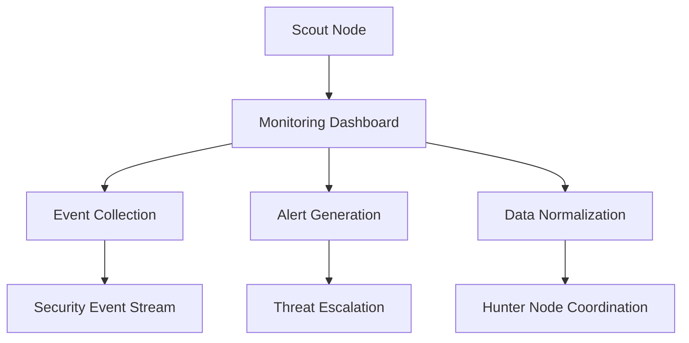
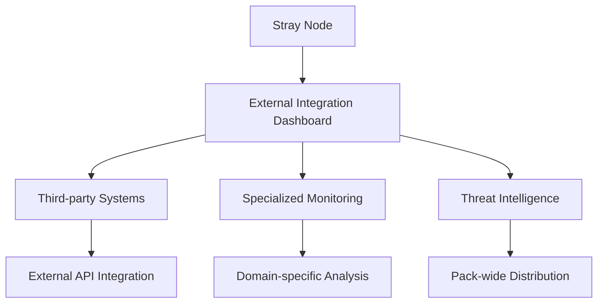
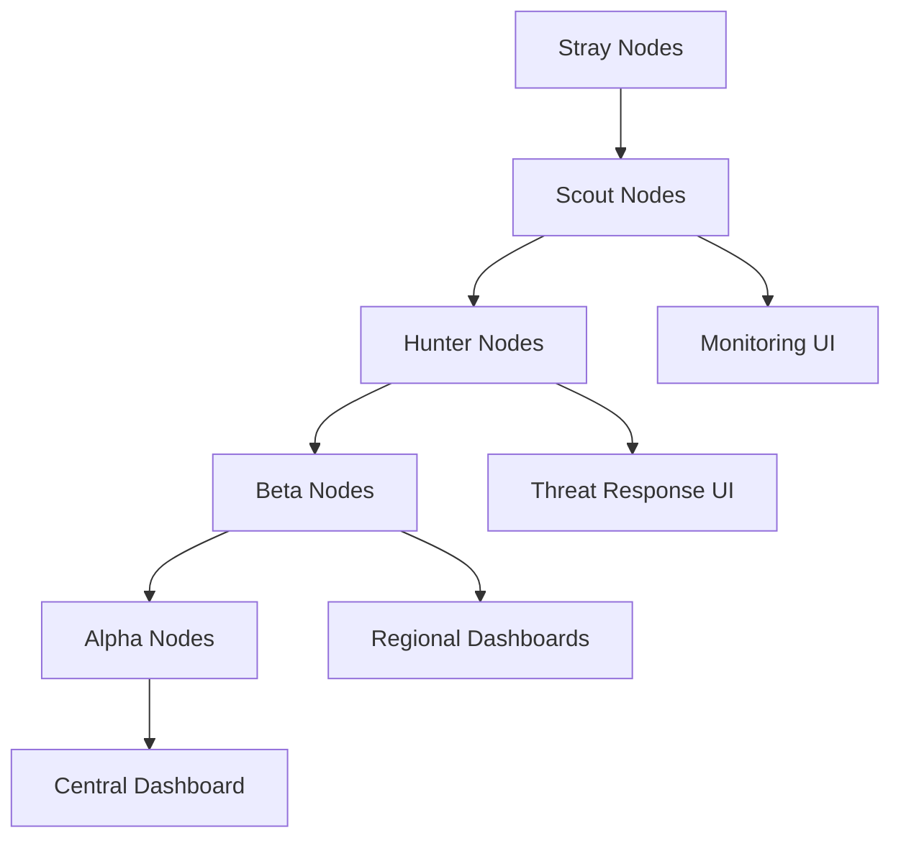
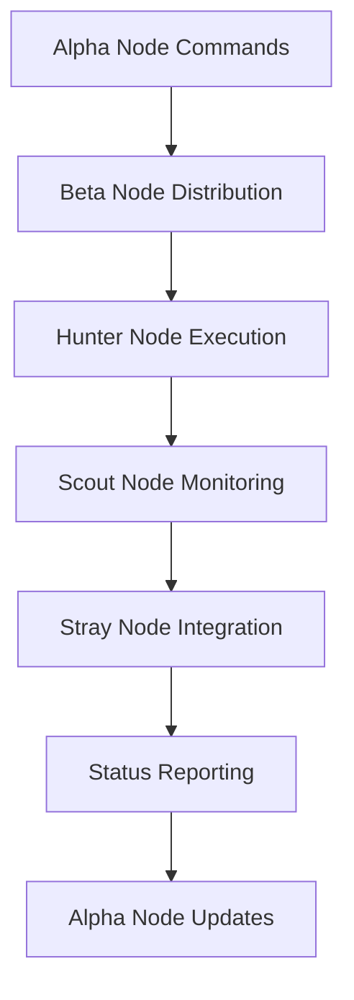
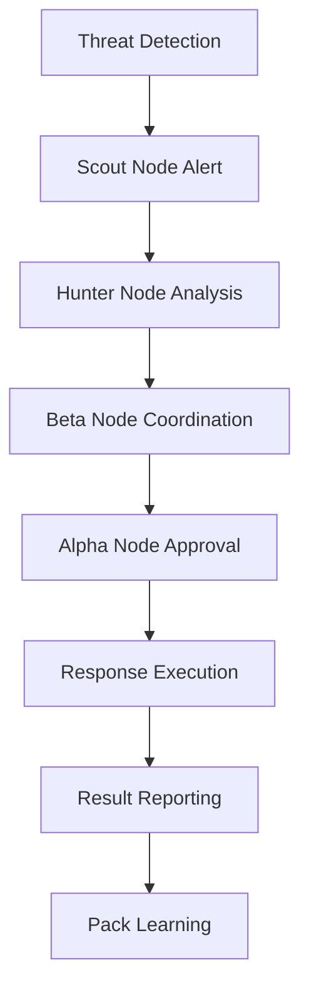

# Wolf Pack Integration Patterns

## Overview

This document defines the integration patterns for leveraging the Wolf Pack hierarchy in the Enterprise SIEM/SOAR dashboard, creating a revolutionary distributed security operations model.

## Wolf Pack Hierarchy Integration

### 1. Alpha Node Integration
**Role**: Central command and strategic coordination
**Dashboard Integration**:
- **Command Center View**: Global security posture and strategic overview
- **Resource Allocation**: Distribution of security tasks across the pack
- **Policy Management**: Centralized security policy enforcement
- **Incident Escalation**: High-level incident management and coordination

### 2. Beta Node Integration
**Role**: Regional analysis and tactical coordination
**Dashboard Integration**:
- **Regional Security Views**: Geographic-specific threat analysis
- **Tactical Response Coordination**: Local incident response management
- **Data Aggregation**: Collection and analysis of regional security data
- **Alpha Communication**: Reporting to Alpha nodes

### 3. Hunter Node Integration
**Role**: Active threat detection and response
**Dashboard Integration**:
- **Threat Hunting Interface**: Advanced threat detection tools
- **Response Orchestration**: Automated response execution
- **Threat Intelligence**: Real-time threat data collection
- **Beta Coordination**: Reporting to Beta nodes

### 4. Scout Node Integration
**Role**: Data collection and monitoring
**Dashboard Integration**:
- **Monitoring Dashboard**: Real-time system monitoring
- **Data Collection**: Security event collection and normalization
- **Alert Generation**: Initial threat detection and alerting
- **Hunter Coordination**: Escalation to Hunter nodes

### 5. Stray Node Integration
**Role**: External integrations and specialized sensors
**Dashboard Integration**:
- **External Integration View**: Third-party system connections
- **Specialized Monitoring**: Domain-specific security monitoring
- **Data Ingestion**: External threat intelligence integration
- **Pack Coordination**: Integration with main pack operations

## Integration Patterns

### 1. Hierarchical Data Flow

### 2. Command and Control Flow

### 3. Threat Response Orchestration

## Dashboard Integration Features

### 1. Pack Hierarchy Visualization
- **Real-time Pack Map**: Visual representation of all pack members
- **Status Indicators**: Health and activity status of each node
- **Communication Flow**: Visualization of data and command flows
- **Resource Allocation**: Display of task distribution across the pack

### 2. Collective Intelligence Dashboard
- **Aggregated Threat Intelligence**: Combined threat data from all pack members
- **Pattern Recognition**: Cross-pack analysis for advanced threat detection
- **Behavioral Analysis**: Collective behavioral baselines and anomaly detection
- **Predictive Analytics**: ML-powered threat prediction using pack data

### 3. Coordinated Response System
- **Response Orchestration**: Automated coordination of response actions
- **Resource Management**: Dynamic allocation of pack resources
- **Escalation Management**: Automatic escalation based on threat severity
- **Effectiveness Monitoring**: Real-time monitoring of response effectiveness

### 4. Prestige System Integration
- **Role-based Access**: Access control based on pack hierarchy
- **Achievement Tracking**: Gamification of security operations
- **Performance Metrics**: Individual and pack performance tracking
- **Reward System**: Incentives for effective security operations

## Implementation Strategy

### Phase 1: Basic Integration
- Implement basic API endpoints for each pack member type
- Create hierarchical data flow patterns
- Establish command and control communication
- Basic status monitoring and reporting

### Phase 2: Advanced Coordination
- Implement coordinated response orchestration
- Add collective intelligence features
- Enhance pack hierarchy visualization
- Integrate prestige system

### Phase 3: AI-Powered Operations
- Add ML-powered threat detection across the pack
- Implement predictive analytics
- Enhance automated response capabilities
- Advanced behavioral analysis

### Phase 4: Enterprise Scale
- Multi-pack coordination
- Global threat intelligence sharing
- Advanced resource optimization
- Enterprise-grade scalability

## Security Considerations

### 1. Pack Communication Security
- End-to-end encryption for all pack communications
- Secure authentication between pack members
- Integrity verification for all data exchanges
- Secure key management for pack coordination

### 2. Hierarchical Access Control
- Role-based access control based on pack hierarchy
- Need-to-know principle for information sharing
- Secure escalation procedures
- Audit trails for all pack operations

### 3. Data Protection
- Encryption of sensitive threat intelligence
- Secure data retention and disposal
- Privacy protection for collected data
- Compliance with data protection regulations

## Performance Optimization

### 1. Distributed Processing
- Load balancing across pack members
- Caching strategies for frequently accessed data
- Optimized data flow patterns
- Efficient resource utilization

### 2. Real-time Processing
- Stream processing for immediate threat detection
- In-memory data structures for fast access
- Optimized communication protocols
- Real-time dashboard updates

### 3. Scalability
- Horizontal scaling of pack members
- Dynamic resource allocation
- Efficient data distribution
- Performance monitoring and optimization

This Wolf Pack integration creates a revolutionary approach to distributed security operations, leveraging the collective intelligence and coordinated response capabilities of the entire pack for unparalleled security effectiveness.