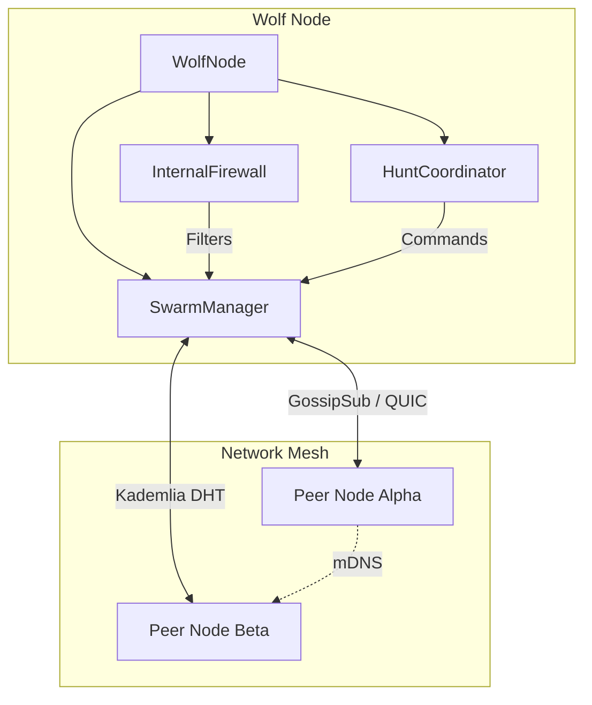

# Wolf Net: Advanced P2P Networking & Coordination

> **Status**: Production Ready (Version 0.1.0)
> **Architecture**: Libp2p with custom "Wolf Pack" consensus
> **Transport**: QUIC (HyperPulse) + TCP/Noise

Wolf Net is the core networking module for the Wolf Prowler ecosystem. It provides a secure, encrypted peer-to-peer mesh network designed for distributed threat detection, consensus-based decision making, and resilient message routing.

## 🏗️ Architecture

Wolf Net encapsulates the complexity of `libp2p` into a structured hierarchy of managers and actors. This ensures that network logic is decoupled from application business logic.

### Core Components

1.  **`WolfNode` (System Facade)**
    *   **Role**: Top-level orchestrator. It initializes and wires together the Swarm, Firewall, and Reporting services.
    *   **Usage**: Prevents `main.rs` bloat by handling the async lifecycle of valid sub-services.

2.  **`SwarmManager` (Network Engine)**
    *   **Role**: Manages the low-level `libp2p` swarm.
    *   **Capabilities**:
        *   **Discovery**: Integrates mDNS (local) and Kademlia DHT (global) for robust peer finding.
        *   **Connection Management**: Handles multi-transport negotiation (IPv4/IPv6, TCP/QUIC).
        *   **Health Checks**: Maintains active connections via Ping/Pong protocols.

3.  **`HuntCoordinator` (Consensus Engine)**
    *   **Role**: Implements the "Wolf Pack" actor model for distributed operations.
    *   **Lifecycle**: `Scent` (Detection) -> `Stalk` (Verification) -> `Strike` (Action).
    *   **Elections**: Manages Alpha Node selection based on prestige scores.

4.  **`InternalFirewall` (Security)**
    *   **Role**: Application-layer traffic control.
    *   **Filter**: Dynamic Allow/Deny rules based on Peer ID, IP, Port, or Protocol.
    *   **Integration**: Can automatically ban peers based on `wolfsec` threat assessments.

### Topology & Routing

Wolf Net creates a structured mesh topology:
- **GossipSub**: Used for high-throughput, low-latency broadcasting of alerts and heartbeat signals.
- **Request-Response**: Direct, reliable signaling for specific commands (e.g., specific peer queries).
- **Direct Messaging**: ChaCha20-Poly1305 encrypted streams for sensitive data transfer between established peers.



## 🔒 Security Specifications

Wolf Net adheres to a "Secure by Default" philosophy:

*   **Transport Security**: All connections are encrypted using the **Noise** protocol framework with **ChaCha20-Poly1305** and **X25519** key exchange.
*   **Identity**: Peer IDs are cryptographically derived from Ed25519 public keys.
*   **Forward Secrecy**: Ephemeral keys are used for each session, ensuring past sessions cannot be decrypted if long-term keys are compromised.
*   **Application Encryption**: Sensitive payloads are arguably double-wrapped via `wolf_den` integration (see `EncryptedMessageHandler`).

## 💻 Usage

### Initialization

To start a standard node with default discovery settings:

```rust
use wolf_net::{WolfNode, WolfConfig, NetworkConfig};
use std::sync::Arc;

#[tokio::main]
async fn main() -> anyhow::Result<()> {
    // 1. Load Configuration
    let net_config = NetworkConfig::default();
    
    // 2. Initialize the Node System
    // WolfNode handles Swarm creation, mDNS, and DHT bootstrapping automatically.
    let mut node = WolfNode::new(net_config).await?;
    
    // 3. Start the Event Loop
    // This runs the swarm, discovery, and reporting services concurrently.
    node.run().await?;
    
    Ok(())
}
```

### Sending a Message

```rust
use wolf_net::{SwarmCommand, PeerId};

// Assuming access to the command channel (usually passed to other actors)
async fn send_alert(command_sender: &mpsc::Sender<SwarmCommand>, target: PeerId, data: Vec<u8>) {
    let _ = command_sender.send(SwarmCommand::SendMessage {
        peer: target,
        data,
    }).await;
}
```

## 📦 Dependencies

Defined in `Cargo.toml`:
*   `libp2p` (v0.53): Core networking stack.
*   `tokio` (v1.35): Async runtime.
*   `x25519-dalek` / `ed25519-dalek`: Cryptographic primitives.
*   `bincode`/`serde`: Serialization.

## 🔍 Module breakdown

| Module | Description |
| :--- | :--- |
| `p2p` | Core `NetworkBehaviour` combining GossipSub, Kademlia, and Request-Response. |
| `discovery` | mDNS and DHT discovery logic logic. |
| `wolf_pack` | Consensus and coordination logic (Hunt Protocol). |
| `firewall` | Traffic filtering and rule management. |
| `security` | Verification of signed envelopes and message integrity. |