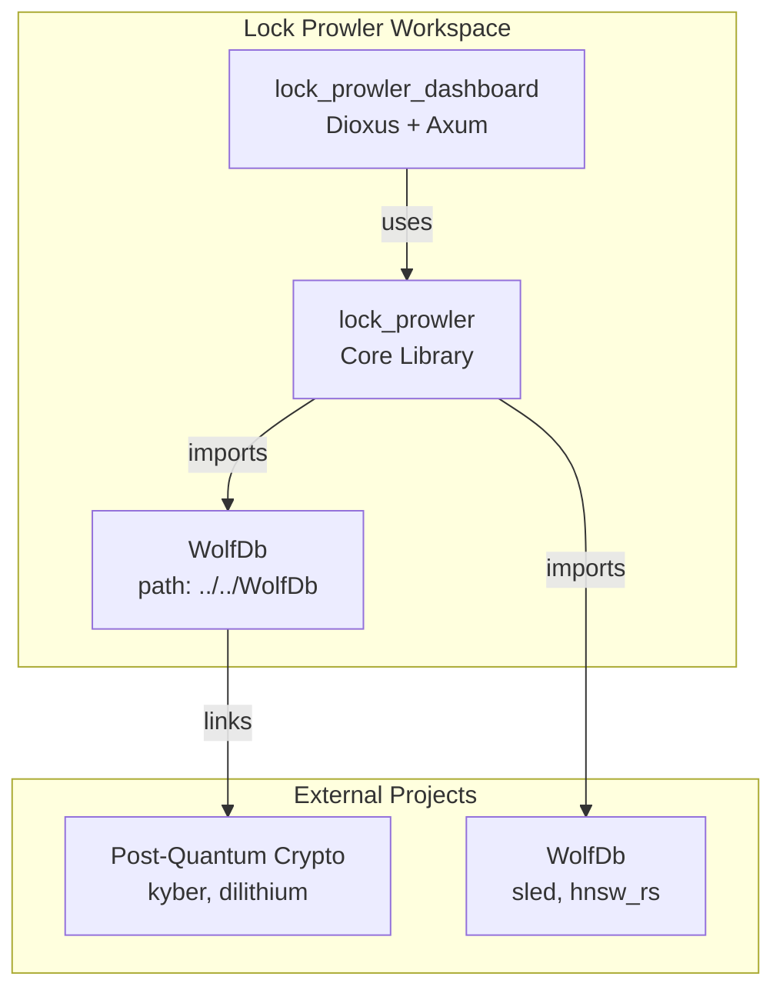
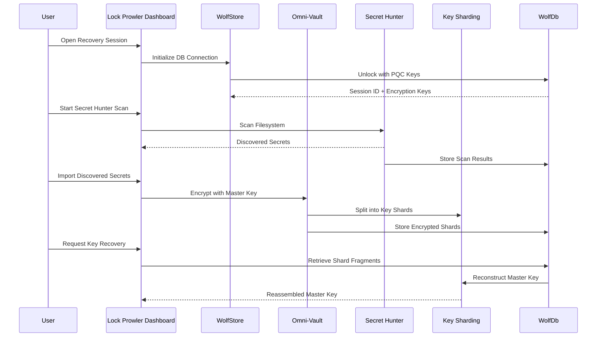

# The Wolf_Security_Ecosystem Platform

**Codename:** Fenrir
**Workspace Name:** `wolf_security_ecosystem`
**Inspiration Document:** Inspiration.md
**Goal:** Revolutionize Cyber Security via Decentralized, Quantum-Resistant Intelligence.

## 🌟 The Vision

We are piecing together four disparate high-performance Rust projects into a single, comprehensive "Cyber-Immunology" system. This platform does not just defend; it learns, hunts, and adapts.

---

## 🏗️ The Four Pillars

### 1. The Heart: `TersecPot` (Trust)
**"The Vault"**
- **Role**: Secure Enclave & Identity Provider.
- **Function**: Manages the master keys and identity for the entire ecosystem. Nothing moves in the network without cryptographic proof from TersecPot.
- **Technology**: Multi-Party Computation (MPC), Air-gapped Protocols.

### 2. The Brain: `WolfDb` (Memory)
**"The Cortex"**
- **Role**: High-Performance Vector Database.
- **Function**: Stores threat signatures, network logs, and forensic data using Post-Quantum Cryptography (PQC). It allows for semantic search of threat vectors.
- **Technology**: `sled`, `pqc_kyber`, `pqc_dilithium`, `hnsw_rs` (Hierarchical Navigable Small World graphs).

### 3. The Nervous System: `Wolf Prowler` (Communication)
**"The Pack"**
- **Role**: Peer-to-Peer Security Mesh.
- **Function**: A decentralized network that shares threat intelligence in real-time. If one node detects a threat, the entire pack knows instantly.
- **Technology**: `libp2p`, Gossipsub, Raft Consensus.

### 4. The Hands: `Lock Prowler` (Action)
**"The Hunter"**
- **Role**: Forensic Agent & Recovery Tool.
- **Function**: The active component that performs deep disk analysis, BitLocker recovery, and incident response on endpoints.
- **Technology**: NTFS Parsing, FVE Metadata Analysis, Dioxus Neural Dashboard.

---

## 🧩 Current Architecture State

### Crate Dependencies



### Data Flow Analysis



---

## 🔗 Dashboard Integration Roadmap

### Phase 1: Dashboard-to-WolfDb Wiring ✅ COMPLETE

**Objective:** Enable persistent storage for dashboard sessions.

| Component | Current State | Target State | Status |
|-----------|--------------|--------------|--------|
| `lock_prowler_dashboard` | Simulated entropy | Real DB connection | ✅ Complete |
| `lock_prowler/src/storage.rs` | Basic WolfStore | Full session management | ✅ Complete |
| Server functions | `initialize_db()` | `unlock_db()`, `save_session_to_db()` | ✅ Complete |
| Dashboard stats | In-memory | DB connection status display | ✅ Complete |

### Phase 2: Vault Integration with WolfDb ✅ COMPLETE

**Objective:** Store encrypted vault entries in WolfDb.

| Component | Current State | Target State | Status |
|-----------|--------------|--------------|--------|
| `vault.rs` | In-memory only | Persistent storage | ✅ Complete |
| `Vault::save_to_db()` | - | Persist encrypted entries | ✅ Complete |
| `Vault::load_from_db()` | - | Restore entries on startup | ✅ Complete |
| Key sharding | Partial | Full Shamir Secret Sharing | ✅ Complete |

### Phase 3: Hunter-to-WolfDb Reporting 🔄 IN PROGRESS

**Objective:** Store discovered secrets and scan results in WolfDb.

| Component | Current State | Target State | Action |
|-----------|--------------|--------------|--------|
| `hunter.rs` | Returns Vec in-memory | Reports to WolfDb | Add WolfDb insert calls |
| Secret types | Enum only | Indexed searchable | Add vector embeddings |
| Dashboard scan UI | Not integrated | Real scan interface | Wire to Hunter API |
| Scan results storage | In-memory | Persistent in WolfDb | Add storage operations |

### Phase 4: Shard Management Dashboard 🔄 IN PROGRESS

**Objective:** Visualize and manage key shards in the dashboard.

| Component | Current State | Target State | Action |
|-----------|--------------|--------------|--------|
| Shard storage | In-memory | Persistent in WolfDb | Add shard table operations |
| Dashboard shard UI | Not implemented | Shard visualization | Create shard panel |
| Recovery flow | Simulated logs | Real shard retrieval | Connect to WolfDb |

### Phase 5: Unified Dashboard Operations ⏳ PENDING

**Objective:** Complete dashboard integration with all systems.

| Component | Current State | Target State | Action |
|-----------|--------------|--------------|--------|
| Vault entry CRUD | Limited | Full CRUD | Add list/add/delete APIs |
| Session persistence | Basic | Cross-session | Save/restore on startup |
| Real-time updates | None | Auto-refresh | Add websocket/SSR updates |
| Wolf Prowler mesh | Not connected | P2P integration | Hook into P2P mesh |

---

## 📊 Dashboard Integration Architecture

### Unified Dashboard View

```mermaid
graph TD
    subgraph "Lock Prowler Dashboard - Unified View"
        Direction TB
        
        Header[System Status Header<br/>WolfDb Status | Pack Members | Mode] --> Grid
        
        Grid --> Panel1[Volume Analysis<br/>Encryption Strength | Sector Entropy]
        Grid --> Panel2[Neural Recovery<br/>Key Shards | Reconstruction Progress]
        Grid --> Panel3[Omni-Vault<br/>Discovered Secrets | Recovery Logs]
        Grid --> Panel4[Hunter Results<br/>Scan Status | Found Secrets]
        
        Panel1 --> Storage1[(WolfDb<br/>Forensics Table)]
        Panel2 --> Storage2[(WolfDb<br/>Shards Table)]
        Panel3 --> Storage3[(WolfDb<br/>Vault Table)]
        Panel4 --> Storage4[(WolfDb<br/>Scan Results Table)]
    end
```

### API Endpoints Required

| Endpoint | Method | Purpose | Handler | Status |
|----------|--------|---------|---------|--------|
| `/api/stats` | GET | System statistics | `get_fullstack_stats` | ✅ Complete |
| `/api/db/init` | POST | Initialize DB | `initialize_db()` | ✅ Complete |
| `/api/db/unlock` | POST | Unlock with key | `unlock_db()` | ✅ Complete |
| `/api/sessions` | GET/POST | Session management | CRUD operations | ✅ Complete |
| `/api/vault` | GET/POST | Vault operations | Add/list secrets | 🔄 Partial |
| `/api/vault/add` | POST | Add vault entry | `add_vault_entry()` | ⏳ Pending |
| `/api/vault/list` | GET | List vault entries | `list_vault_entries()` | ⏳ Pending |
| `/api/vault/delete` | DELETE | Delete vault entry | `delete_vault_entry()` | ⏳ Pending |
| `/api/hunter/scan` | POST | Start scan | SecretScanner | 🔄 Partial |
| `/api/hunter/results` | GET | Scan results | Fetch from WolfDb | 🔄 Partial |
| `/api/shards` | GET/POST | Shard management | Key recovery | 🔄 Partial |
| `/api/shards/save` | POST | Save shard | `save_shard()` | ⏳ Pending |
| `/api/shards/recover` | POST | Recover key | `recover_key()` | ⏳ Pending |

---

## 🚧 Current Integration Status

### ✅ Completed
- Basic vault encryption (AES-256-GCM)
- Secret scanner with regex rules
- Dioxus dashboard UI framework
- Axum server infrastructure
- WolfDb dependency reference in lock_prowler/Cargo.toml
- **Phase 1: Dashboard-to-WolfDb Wiring COMPLETE**
- **Phase 2: Vault Integration COMPLETE**
- WolfStore integration with session save/load
- Dashboard displays WolfDb connection status

### 🔄 In Progress
- Hunter scan results storage to WolfDb
- Shard storage/retrieval to WolfDb
- Vault entry list/add/delete APIs
- Dashboard UI for vault management

### ⏳ Pending
- P2P mesh integration (Wolf Prowler external repo)
- PQC key management
- Cross-session vault persistence
- Real-time threat intelligence feed

---

## 🎯 Next Steps

### Immediate Actions

1. **Complete Phase 3: Hunter Integration**
   - Add `save_scan_result()` to WolfStore
   - Add `get_scan_results()` to WolfStore
   - Wire `/api/hunter/scan` to persist results
   - Create Hunter results panel in dashboard

2. **Complete Phase 4: Shard Management**
   - Add `save_shard()` to WolfStore
   - Add `get_shards()` to WolfStore
   - Add `recover_from_shards()` method
   - Create Shard visualization in dashboard

3. **Complete Phase 5: Unified Dashboard**
   - Add vault entry CRUD APIs
   - Implement session persistence across restarts
   - Add real-time status refresh

### Medium-term Goals

1. **Session persistence across restarts**
2. **Real-time threat intelligence feed**
3. **Multi-node WolfPack mesh visualization**
4. **PQC key backup and recovery**

---

## 🔐 Security Considerations

All integrations must maintain:

1. **Zero-trust architecture** - Every component verifies identity
2. **Post-quantum cryptography** - Use Kyber/Dilithium for key exchange
3. **Air-gap compatibility** - Optional offline mode support
4. **Audit logging** - All vault access logged to WolfDb
5. **Shard distribution** - No single point of failure for master keys

---

## 📚 References

- **Project Map**: [`PROJECT_MAP_1-5-26.md`](PROJECT_MAP_1-5-26.md)
- **Lock Prowler Core**: [`lock_prowler/src/lib.rs`](lock_prowler/src/lib.rs)
- **Dashboard Entry**: [`lock_prowler_dashboard/src/main.rs`](lock_prowler_dashboard/src/main.rs)
- **Storage Layer**: [`lock_prowler/src/storage.rs`](lock_prowler/src/storage.rs)
- **Vault Module**: [`lock_prowler/src/vault.rs`](lock_prowler/src/vault.rs)
- **Hunter Module**: [`lock_prowler/src/hunter.rs`](lock_prowler/src/hunter.rs)
- **Sharding Module**: [`lock_prowler/src/sharding.rs`](lock_prowler/src/sharding.rs)

---

*Document Version: 3.0*
*Last Updated: 2026-01-05*
*Status: Phase 1-2 Complete - Phase 3-5 In Progress*
