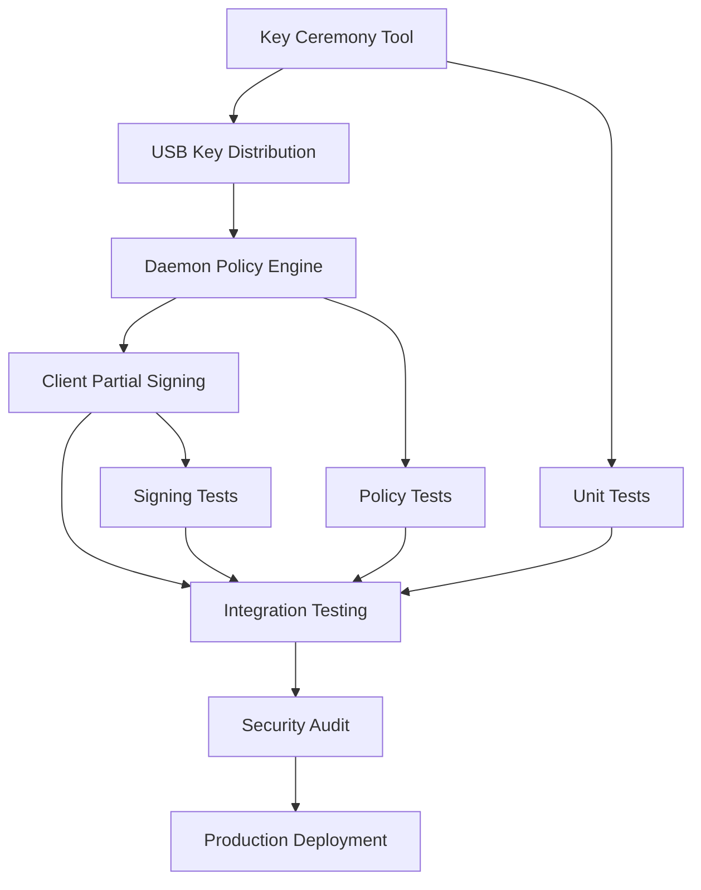

# Four-Eyes Vault Feature Implementation Plan

## Overview
The Four-Eyes Vault feature enhances TersecPot with air-gapped key ceremonies, role-based policy enforcement, and multi-party signing workflows. This ensures compliance with dual-authorization requirements for high-security operations.

## Current Architecture Analysis
- **Client**: Encrypts commands with ML-KEM-1024 + AES-256-GCM, signs ciphertext with ML-DSA-44 keys, supports M-of-N threshold signing
- **Daemon**: Verifies signatures against authorized public keys, decrypts, enforces sequence numbers, waits for out-of-band pulse
- **Shared**: Provides cryptographic primitives and postbox utilities
- **Key Management**: Keys stored in postbox directory, public keys in `authorized_keys/`, private keys local to client
- **Pulse Methods**: USB file, web log scanning, TCP connection, cryptographic challenge-response

## Component Specifications

### 1. Key Ceremony Tool
**Purpose**: Air-gapped CLI wizard for secure key generation, distribution, and destruction.

**Features**:
- Air-gapped operation (no network interfaces)
- USB drive writing with verification
- Memory wiping after key operations
- Support for multiple key types (signing, KEM, pulse)
- Ceremony logging for audit trails

**Technical Specs**:
- CLI interface with guided prompts
- USB mount/detection using `lsblk` or `blkid`
- Secure deletion using `shred` or `wipefs`
- Key format: JSON with metadata (role, timestamp, ceremony ID)
- Output: Encrypted USB partitions with HMAC verification

**Dependencies**: None (standalone tool)

### 2. Daemon Policy Engine
**Purpose**: Extend daemon with named roles, metadata parsing, and configurable policies.

**Features**:
- Role-based access control (RBAC) with named roles (e.g., "admin", "operator", "auditor")
- Command metadata parsing (JSON/YAML embedded in commands)
- Configurable policies (approval thresholds, time windows, command patterns)
- Policy validation before execution
- Audit logging of policy decisions

**Technical Specs**:
- Policy file: TOML/JSON in postbox directory
- Role mapping: Public key to role assignments
- Metadata format: Base64-encoded JSON in command payload
- Policy engine: Rule-based evaluation with AND/OR logic
- Integration: Hook into daemon verification loop

**Dependencies**: Extends existing daemon lib.rs and main.rs

### 3. Client Partial Signing Flow
**Purpose**: Enable append-only signature mode for multi-party signing workflows.

**Features**:
- Partial signing: Sign incomplete command bundles
- Signature aggregation: Combine signatures from different parties
- Append mode: Add signatures without full re-signing
- Workflow state tracking: Pending, partially signed, complete
- Secure handover: Encrypted bundles for offline transfer

**Technical Specs**:
- Bundle format: Extended wire format with signature slots
- State file: JSON tracking signing progress
- Append API: CLI command to add signature to existing bundle
- Verification: Threshold checking during aggregation
- Handover: USB or secure channel transfer

**Dependencies**: Extends client lib.rs and main.rs

## Integration Points
- **Key Ceremony**: Outputs keys to postbox/authorized_keys and USB
- **Policy Engine**: Reads policies from postbox/policies.toml
- **Partial Signing**: Modifies package_payload to support partial bundles
- **Existing Code**: Minimal changes to core crypto, major additions to workflow logic

## Security Considerations
- **Air-gapping**: Ceremony tool runs on isolated hardware
- **Key Handling**: Never store private keys unencrypted, wipe memory post-use
- **USB Security**: Encrypt USB partitions, verify integrity
- **Policy Security**: Policies signed with ceremony keys
- **Partial Signing**: Bundles encrypted, signatures verified on append
- **Audit Trails**: All operations logged with timestamps and hashes

## Testing Strategy

### Unit Tests
- Key ceremony: USB detection, key generation, wiping
- Policy engine: Rule evaluation, metadata parsing
- Partial signing: Bundle creation, signature append, aggregation

### Integration Tests
- Full ceremony workflow: Generate → USB → Import
- Policy enforcement: Role assignment, command approval
- Multi-party signing: Partial → Append → Complete → Execute

### Security Tests
- Key leakage: Memory analysis post-wiping
- USB tampering: Integrity verification failures
- Policy bypass: Unauthorized command execution attempts
- Signature forgery: Invalid signature handling

### Performance Tests
- Ceremony time: Key generation and USB writing
- Policy evaluation: Complex rule sets
- Signing aggregation: Large signature bundles

## Deployment and Operational Considerations
- **Installation**: Add ceremony tool to package, update daemon with policy features
- **Configuration**: New environment variables (TERSEC_POLICIES, TERSEC_CEREMONY_MODE)
- **Migration**: Existing keys compatible, policies optional
- **Monitoring**: Audit logs to /var/log/tersecpot/
- **Backup**: Key backups on encrypted USB, policy files versioned
- **Disaster Recovery**: Ceremony re-run procedures, key recovery workflows

## Implementation Roadmap

## Dependencies and Prerequisites
- Rust crates: Add `serde` for JSON/TOML, `blkid` for USB detection
- System tools: `shred`, `cryptsetup` for secure operations
- Hardware: Air-gapped machine for ceremonies, USB drives
- Training: Operators trained on ceremony procedures

## Risk Mitigation
- **Key Loss**: Backup procedures, recovery ceremonies
- **Policy Errors**: Dry-run mode for policy testing
- **Integration Issues**: Feature flags for gradual rollout
- **Security Flaws**: Third-party security review

## Success Metrics
- Ceremony completion time < 30 minutes
- Zero key leakage incidents
- 100% policy enforcement accuracy
- Multi-party signing workflows operational