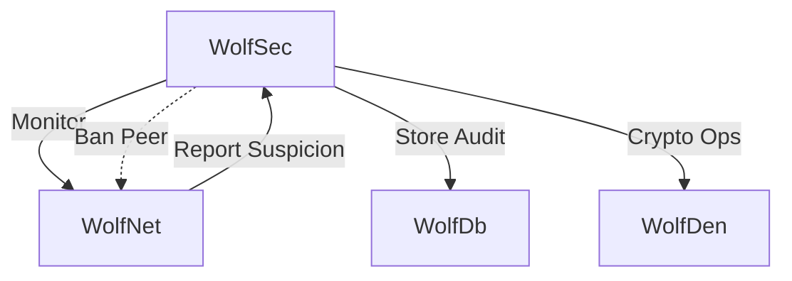
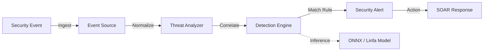

# Wolfsec: Security & Threat Orchestration

> **Status**: Production Ready (Version 0.1.0)
> **Architecture**: Hexagonal + Domain-Driven Design
> **Key Tech**: Post-Quantum Crypto, ONNX ML Threat Detection, Wolf Pack Consensus

Wolfsec is the comprehensive security orchestration module for the Wolf Prowler ecosystem. It combines traditional cybersecurity controls (Firewall, IAM, RBAC) with advanced AI-driven threat detection and "Wolf Pack" distributed consensus for automated response.

## 🏗️ Architecture

Wolfsec follows a **Hexagonal Architecture** (Ports and Adapters) to ensure testability and decoupling of core security logic from infrastructure.

### Component Interaction



### Threat Detection Pipeline

The threat detection engine uses a multi-stage pipeline including signature matching and ML-based anomaly detection.



### Core Layers

1.  **Identity (`identity/`)**:
    *   Handles Authentication (MFA), Authorization (RBAC), and Key Management.
    *   Integrates `wolf_den` for Post-Quantum Cryptography (kyber/dilithium).
    *   Maps **Wolf Pack Ranks** (Alpha, Beta) to permissions.

2.  **Protection (`protection/`)**:
    *   **Network Security**: Firewall rules, allow/deny lists.
    *   **Threat Detection**: Real-time analysis using `ort` (ONNX Runtime) for ML models.
    *   **Reputation**: Peer scoring and bans.

3.  **Observability (`observability/`)**:
    *   **Dashboard**: Real-time metrics for the Web UI.
    *   **Audit**: Tamper-evident logging of all security operations.
    *   **Compliance**: Automated checking against SOC2/GDPR baselines.

## 🛡️ Key Features

*   **Wolf Pack Semantics**:
    *   **Alpha**: Admin/SuperUser capability.
    *   **Beta**: Moderator/Security Officer.
    *   **Guardian**: Defensive subsystem role.
*   **Machine Learning**:
    *   Integrated `ort` for running ONNX models to detect anomalies in network traffic.
    *   `linfa` integration for classical clustering of peer behaviors.
*   **Security Dashboard**:
    *   Real-time visibility into active threats and system health.
    *   Exportable reports (PDF, JSON, CSV).
*   **Automated Response (SOAR)**:
    *   Automatically ban peers, isolate nodes, or rotate keys upon threat confirmation.

## 💻 Usage

### Basic Initialization

```rust
use wolfsec::prelude::*;

#[tokio::main]
async fn main() -> Result<(), WolfSecError> {
    // 1. Initialize Security Manager
    let config = SecurityConfig::default();
    let security_manager = NetworkSecurityManager::new(config).await?;
    
    // 2. Setup Threat Detection
    let threat_detector = ThreatDetector::new(ThreatDetectionConfig::default()).await?;
    
    // 3. Start Monitoring
    // This spins up the async event loop for checking logs and network traffic
    security_manager.start_monitoring().await?;
    
    Ok(())
}
```

### Recording an Audit Event

```rust
use wolfsec::observability::audit::{SecurityAuditor, SecurityOperation, OperationResult};

async fn log_encryption_op(auditor: &SecurityAuditor, user_id: &str) -> anyhow::Result<()> {
    auditor.record_operation(
        SecurityOperation::Encryption,
        OperationResult::Success,
        user_id.to_string(),
        "Encrypted sensitive payload for transmission".to_string(),
    ).await?;
    Ok(())
}
```

## 🔧 Configuration

Configuration can be handled via `security.toml` or Environment Variables.

### Env Vars

```bash
# General
export WOLF_SECURITY_AUDIT_ENABLED=true
export WOLF_SECURITY_AUDIT_LOG_LEVEL=info

# Dashboard
export WOLF_SECURITY_DASHBOARD_REFRESH_INTERVAL=10
export WOLF_SECURITY_DASHBOARD_THEME=dark

# Alerts
export WOLF_SECURITY_ALERTS_ENABLED=true
export WOLF_SECURITY_ALERTS_MAX=1000
```

### TOML Example

```toml
[security.metrics]
collection_interval_secs = 10
enable_anomaly_detection = true
anomaly_threshold = 0.7

[security.reporting]
enable_automated_reports = true
report_interval_hours = 24
```

## 📦 Integration

Wolfsec relies on:
- **`wolf_den`**: For all cryptographic primitives (encryption, signing, key generation).
- **`wolf_net`**: For enforcing network bans and monitoring flow data.
- **`wolf_db`**: For persistent storage of audit logs and configuration (replacing SQLx direct usage).

## 🧪 Testing

```bash
# Run comprehensive security suite
cargo test -p wolfsec --test comprehensive_tests
```
